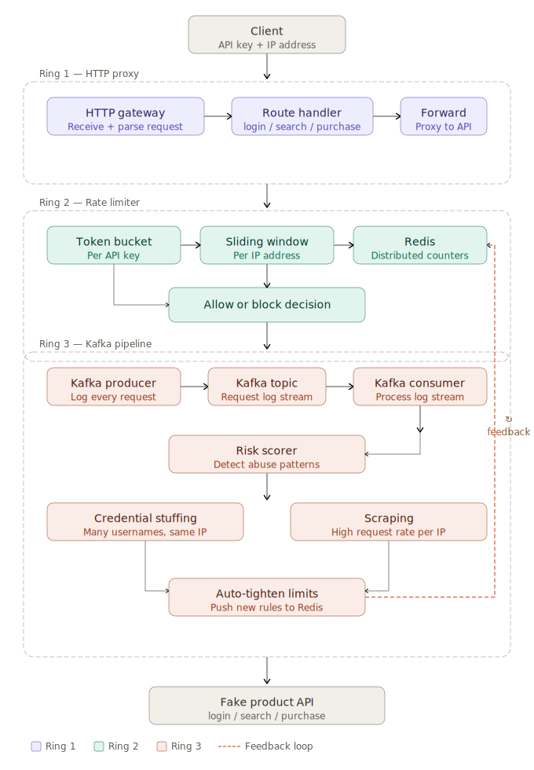

# Abuse-Aware API Gateway

A gateway that sits in front of a product API and decides whether a request is legitimate — not just by checking who's asking, but by learning how they behave over time.

Most rate limiters count requests and stop there. This one watches patterns. A login endpoint hammered with different usernames from the same IP looks nothing like a user who forgot their password. A search endpoint scraped in perfect sequence at inhuman speed looks nothing like a curious shopper. This gateway knows the difference.

---

## How it works

Requests pass through three layers:

**Ring 1 — HTTP proxy**
Every request hits the gateway first. It extracts the API key and IP address, routes to the right endpoint, and forwards to the product API. Nothing gets through without passing through here.

**Ring 2 — Rate limiter**
Two strategies run in parallel. A token bucket controls sustained traffic per API key — each key gets a bucket that refills at a fixed rate, and requests spend tokens. A sliding window tracks request count per IP over a rolling time window. Redis holds all counters so limits are enforced consistently across however many gateway instances are running.

**Ring 3 — Kafka pipeline**
Every request, allowed or blocked, gets logged as an event to Kafka. A consumer reads the stream and computes a risk score per IP and API key, looking for two specific patterns: credential stuffing (many different usernames from the same source in a short window) and scraping (request rate that no human could sustain). When the score crosses a threshold, tighter limits are pushed back into Redis. Ring 2 picks them up automatically on the next request.

---

## Architecture

---

## Stack

- **Go** — gateway, rate limiter, Kafka producer
- **Redis** — distributed rate limit counters
- **Kafka** — request event stream
- **Docker Compose** — local environment

---

## Running locally

_Coming soon._

---

## Design decisions

A full breakdown of the tradeoffs — why token bucket over leaky bucket, what happens when Kafka lags, how false positives are handled — is in [`docs/design.md`](./docs/design.md).
